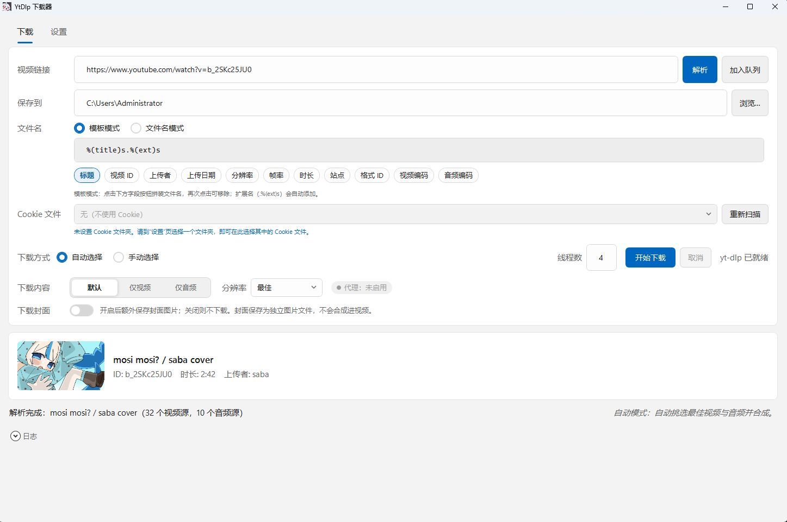
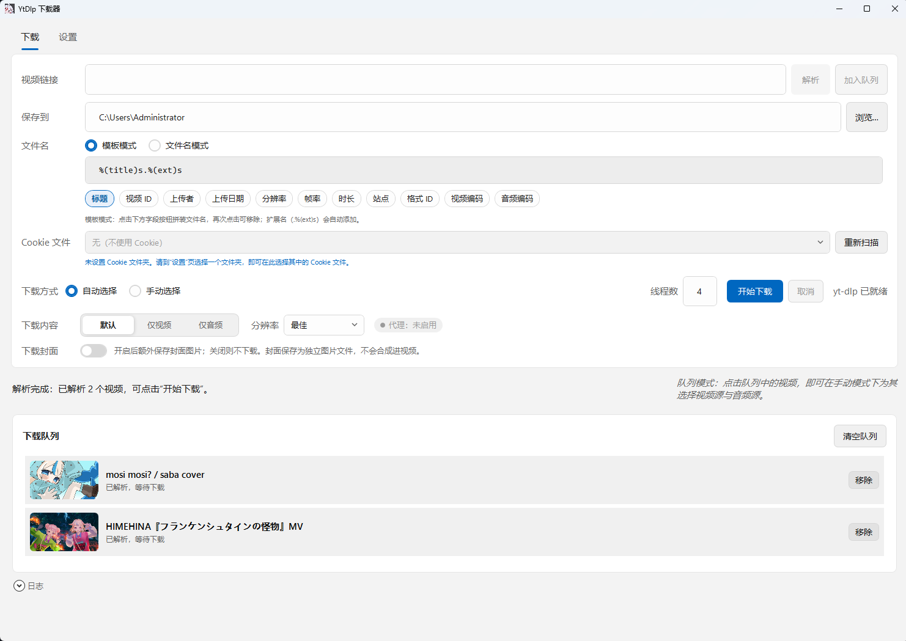
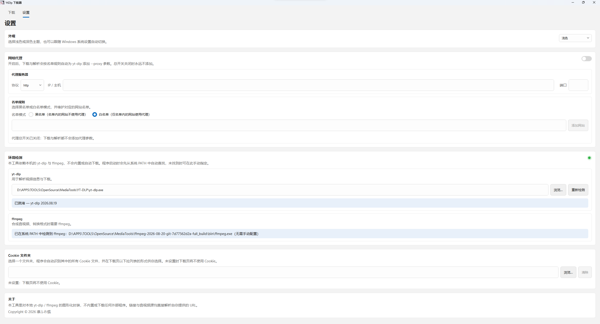

<p align="center">
  
</p>

<h1 align="center">YT-DLP Downloader</h1>

<p align="center">
  <strong>基于本地 yt-dlp / ffmpeg 的 Windows 视频下载器</strong>
</p>

<p align="center">
  
  
  
  <a href="https://github.com/linyaocrush/YT-DLP-Downloader/releases"></a>
</p>

---

一个使用 **WPF + .NET 10** 构建的图形界面下载工具。它只是 `yt-dlp` / `ffmpeg` 的一层薄 GUI：**不会内置、下载或自动安装这两个工具**，需要你自行准备并在「设置」页填写路径。

## 📖 目录

- [✨ 功能特性](#-功能特性)
- [🧰 技术栈](#-技术栈)
- [🚀 快速开始](#-快速开始)
- [💡 使用示例](#-使用示例)
- [🖼️ 界面预览](#-界面预览)
- [⚙️ 配置](#-配置)
- [📁 项目结构](#-项目结构)
- [🧪 开发与测试](#-开发与测试)
- [📦 构建与发布](#-构建与发布)
- [🤝 贡献](#-贡献)
- [📄 许可证](#-许可证)

## ✨ 功能特性

| 分类 | 说明 |
| --- | --- |
| 单条 / 队列下载 | 支持解析单条链接直接下载，也可加入下载队列批量处理并查看每条进度 |
| 媒体信息解析 | 解析标题、上传者、时长、分辨率、缩略图等元数据（`--dump-single-json`） |
| 格式选择 | 自动模式（`bv*+ba/b` + 分辨率偏好）或手动模式（从视频 / 音频源列表中选择具体格式） |
| 下载内容 | 合并音视频 / 仅视频 / 仅音频 |
| 命名规则 | 通过字段模板（标题、ID、上传者、日期、分辨率…）或固定文件名生成输出文件名 |
| Cookie | 指定 Netscape 格式 Cookie 文件，或从 Cookie 文件夹中自动扫描并选择 |
| 代理 | HTTP / HTTPS / SOCKS5，支持白名单 / 黑名单站点列表，可一键开关 |
| 并发分片 | 通过 `--concurrent-fragments` 设置并发分片数（默认 4） |
| 封面导出 | 可选将封面另存为独立图片文件（`--write-thumbnail`） |
| 主题外观 | 浅色 / 深色 / 跟随系统，适配 Windows 11 风格控件 |
| 系统集成 | 任务栏下载进度、下载完成通知 |

> [!NOTE]
> 与「设置」页的 yt-dlp / ffmpeg 版本、命令行为相关的状态会在界面上实时显示，便于排查。

## 🧰 技术栈

- **语言 / 框架**：C#、.NET 10、WPF（`net10.0-windows`）
- **架构**：MVVM。`Core` 为 `net10.0` 类库，不含任何 UI 依赖；`App` 为 WPF 界面层
- **依赖注入**：`src/YtDlpDownloader.App/App.xaml.cs` 中的手写组合根（无 DI 容器）
- **Windows Forms**：仅用于 `FolderBrowserDialog`，全局 `using` 已移除以避免与 WPF 冲突
- **混淆**：Release 构建通过 [Obfuscar](https://www.nuget.org/packages/Obfuscar) 自动混淆输出程序集
- **测试**：xUnit + Moq，配合 `coverlet.collector` 收集覆盖率
- **代码质量**：内置 Roslyn 分析器（`AnalysisLevel=latest-recommended`）+ `.editorconfig`，经 `EnforceCodeStyleInBuild` 参与编译，无第三方分析器包

## 🚀 快速开始

### 前置要求

- **Windows** 操作系统
- **.NET 10 SDK**（仅从源码构建时需要）

  - 若使用 **不内置运行库** 发行版：目标机器需已安装 **.NET 10 运行时**
  - 若使用 **内置运行库** 发行版：无需单独安装运行时
- **yt-dlp.exe** —— 必需，需自行下载
- **ffmpeg**（可选但推荐）—— 合并音视频、转码等场景需要；已在系统 `PATH` 中或在此应用的「设置」页指定 `ffmpeg.exe` 路径

> [!WARNING]
> 本项目**不包含也不下载** yt-dlp / ffmpeg。运行前请确保已安装 yt-dlp，并在「设置」页填写其路径。

### 安装（从源码构建）

```powershell
git clone https://github.com/linyaocrush/YT-DLP-Downloader.git
cd YT-DLP-Downloader
dotnet build
```

也可直接前往 [Releases](https://github.com/linyaocrush/YT-DLP-Downloader/releases) 下载已构建好的版本，无需自行编译。

### 运行

```powershell
dotnet run --project src\YtDlpDownloader.App\YtDlpDownloader.App.csproj
```

或直接运行调试产物：

```powershell
src\YtDlpDownloader.App\bin\Debug\net10.0-windows\YtDlpDownloader.exe
```

首次启动后，进入「设置」页配置 **yt-dlp 路径**（必需）与 **ffmpeg 路径**（可选），即可在「下载」页开始使用。

## 💡 使用示例

界面为纯图形化操作，典型流程如下：

1. 在「设置」页：
   - 选择 `yt-dlp.exe` 路径；
   - （可选）选择 `ffmpeg.exe` 路径、下载目录、Cookie 文件 / 文件夹；
   - （可选）配置代理协议、主机、端口及白名单 / 黑名单站点。
2. 在「下载」页粘贴视频链接，应用会调用 yt-dlp 解析媒体信息并展示缩略图与元数据。
3. 选择下载方式：
   - **自动**：按分辨率偏好自动挑选格式；
   - **手动**：从可用的视频 / 音频源列表中选择具体格式。
4. 选择下载内容（合并 / 仅视频 / 仅音频）、命名方式（模板或固定名）。
5. 点击下载，或加入队列批量处理，通过进度条、速度、ETA 与任务栏进度查看状态。

## 🖼️ 界面预览

| 下载页 | 队列模式 |
| :---: | :---: |
|  |  |

| 设置页 | |
| :---: | :--- |
|  | 配置 `yt-dlp` / `ffmpeg` 路径、下载目录、Cookie、代理与主题等 |

> [!NOTE]
> 截图为浅色主题下的实际界面，随版本更新可能略有差异。

## ⚙️ 配置

所有设置均通过界面修改，并持久化为 JSON 文件（`JsonStringEnumConverter`）。文件写入 **程序所在目录**（从源码运行时即 `bin\...` 下的 exe 目录），文件名为 `settings.json`。

| 配置项 | 说明 | 默认值 | 必填 |
| --- | --- | --- | --- |
| `YtDlpPath` | `yt-dlp.exe` 路径 | 空 | 是 |
| `FfmpegPath` | `ffmpeg.exe` 路径（通过 `--ffmpeg-location` 传给 yt-dlp） | 空 | 否 |
| `DownloadDirectory` | 下载保存目录 | 空 | 否 |
| `CookieFile` | Netscape 格式 Cookie 文件（`--cookies`） | 空 | 否 |
| `CookieFolder` | 供下载页扫描 Cookie 文件的文件夹 | 空 | 否 |
| `DownloadThreads` | 并发分片数（`--concurrent-fragments`） | `4` | 否 |
| `OutputNameMode` | 命名方式：`Template` / `Fixed` | `Template` | 否 |
| `OutputTemplate` | 模板字段（空格分隔，不含扩展名） | `%(title)s` | 否 |
| `OutputFileName` | 固定文件名模式使用的基础名（自动追加扩展名） | 空 | 否 |
| `DownloadKind` | 下载内容：`Default` / `VideoOnly` / `AudioOnly` | `Default` | 否 |
| `Resolution` | 自动模式分辨率偏好：`Best` / `Above4K` / `UpTo4K` / `UpTo2K` / `UpTo1080P` / `UpTo720P` / `UpTo360P` | `Best` | 否 |
| `WriteThumbnail` | 是否另存封面图片（`--write-thumbnail`） | `false` | 否 |
| `ProxyEnabled` | 代理总开关 | `false` | 否 |
| `ProxyProtocol` | 代理协议：`Http` / `Https` / `Socks5` | `Http` | 否 |
| `ProxyHost` | 代理主机 / IP | 空 | 否 |
| `ProxyPort` | 代理端口（文本，编辑时不做校验） | 空 | 否 |
| `ProxyListMode` | 站点列表模式：`Whitelist` / `Blacklist` | `Whitelist` | 否 |
| `ProxySites` | 代理规则适用的站点（主机名或 URL 前缀）列表 | 空 | 否 |
| `Theme` | 主题：`Light` / `Dark` / `System` | `System` | 否 |

> [!TIP]
> 不填写 `FfmpegPath` 时，应用不会向 yt-dlp 传 `--ffmpeg-location`，由 yt-dlp 自行在系统 `PATH` 中查找 ffmpeg。

## 📁 项目结构

```text
YtDlpDownloader/
├─ assets/
│  ├─ logo.jpg                    # README 顶部展示图标
│  └─ screenshot-*.png            # README 界面预览截图
├─ dist/                          # 输出目录（已被 .gitignore 忽略，当前为空）
├─ src/
│  ├─ YtDlpDownloader.Core/       # net10.0 类库，无 UI 依赖
│  │  ├─ Models/                  # AppSettings、MediaInfo、ProxyRules、YtDlpFormat
│  │  ├─ Mvvm/                    # ObservableObject、RelayCommand、AsyncRelayCommand
│  │  └─ Services/                # YtDlpCli、ProcessRunner、MediaInfoParser、
│  │                              # SettingsService、YtDlpPathService、FfmpegPathService
│  └─ YtDlpDownloader.App/        # net10.0-windows WPF 界面（AssemblyName: YtDlpDownloader）
│     ├─ App.xaml(.cs)            # 应用入口 + 手写组合根
│     ├─ logo.ico                 # 程序 / 窗口图标
│     ├─ Converters/             # 值转换器
│     ├─ Services/                # 任务栏进度、完成通知
│     ├─ Styles/                  # Win11Theme / LightTheme / DarkTheme
│     ├─ Themes/、Theming/        # 主题管理
│     ├─ ViewModels/              # Main / Download / Settings / QueueItem 等
│     └─ Views/                   # MainWindow、DownloadView、SettingsView
├─ .editorconfig                  # 仓库级代码风格 / 分析器配置
├─ Directory.Build.props          # 共享 MSBuild 属性（分析器、Nullable、LangVersion）
├─ tests/                         # xUnit 测试项目
│  ├─ YtDlpDownloader.Core.Tests/ # 覆盖 Core（模型 / MVVM / 服务）
│  └─ YtDlpDownloader.App.Tests/  # 覆盖 App（转换器 / ViewModel）
├─ LICENSE                        # 自定义许可证
├─ YtDlpDownloader.slnx           # 新版 XML 解决方案格式
└─ README.md
```

## 🧪 开发与测试

```powershell
# 构建整个解决方案
dotnet build

# 运行全部单元测试
dotnet test

# 代码风格：自动修复（写入）
dotnet format

# 代码风格：仅校验（作为门禁）
dotnet format YtDlpDownloader.slnx --verify-no-changes

# 静态分析门禁：将分析器警告视为错误
dotnet build /p:TreatWarningsAsErrors=true
```

仓库包含两个基于 **xUnit** 的测试项目（`tests/`），当前共 **152** 个测试（Core 125、App 27），全部通过。Core 测试使用 **Moq**，两个项目均通过 `coverlet.collector` 支持覆盖率收集：

- `tests/YtDlpDownloader.Core.Tests/` —— 覆盖 `Core` 的模型、MVVM 基类、媒体解析与进程 / 设置服务；
- `tests/YtDlpDownloader.App.Tests/` —— 覆盖 `App` 的转换器与 ViewModel。

代码质量由仓库级配置统一约束，**不引入任何第三方分析器包**：

- `.editorconfig` —— 通用格式（缩进 / UTF-8 / 末尾换行）、C# 风格与命名规则，并把无法在无语义变更前提下满足的规则严重级别下调为 `suggestion`；
- `Directory.Build.props` —— 开启内置 Roslyn 分析器（`AnalysisLevel=latest-recommended`）与 `EnforceCodeStyleInBuild`，使 `.editorconfig` 风格参与编译；
- `TreatWarningsAsErrors` 不写死在 props 中，门禁时通过命令行 `/p:TreatWarningsAsErrors=true` 开启。

> [!NOTE]
> 仓库目前**没有 CI**。验证方式为 `dotnet build` 达到 **0 警告 0 错误**、`dotnet test` 全部通过、`dotnet format --verify-no-changes` 无差异，并手动启动应用确认界面行为。

## 📦 构建与发布

### 发行版

[Releases](https://github.com/linyaocrush/YT-DLP-Downloader/releases) 提供两种 Windows **单文件**发行版，均**无需安装**，下载后直接运行即可：

| 发行版 | 运行库 | 适用场景 |
| --- | --- | --- |
| 内置运行库 | 已打包 .NET 10 运行时（self-contained） | 目标机器无需安装 .NET，体积较大 |
| 不内置运行库 | 依赖目标机器已安装的 .NET 10 运行时（framework-dependent） | 体积较小 |

> [!NOTE]
> 项目**不提供安装包**（无 MSI / 安装向导）。

### 从源码构建

```powershell
# Release 构建（会自动执行 Obfuscar 混淆）
dotnet build -c Release
```

Release 构建完成后会通过 Obfuscar 混淆输出的 `YtDlpDownloader.dll` 与 `YtDlpDownloader.Core.dll`（配置见 `src/YtDlpDownloader.App/obfuscar.xml`）。如需关闭混淆：

```powershell
dotnet build -c Release -p:ObfuscateRelease=false
```

也可在发布后手动执行：

```powershell
Obfuscar.Console.exe obfuscar.xml
```

## 🤝 贡献

- 提交信息使用中文 conventional-commit 前缀（`feat:` / `fix:` / `chore:` / `docs:`）。
- 界面文案为中文。
- 修改后请确保 `dotnet format --verify-no-changes` 无差异、`dotnet test` 全部通过。
- 新增依赖前，请确认其许可证与本项目兼容。

## 📄 许可证

本项目采用自定义的 **YT-DLP Downloader 非商业相同方式共享许可证 1.0**
（YT-DLP Downloader Non-Commercial Share-Alike License 1.0），详见 [LICENSE](./LICENSE)。

要点（以 `LICENSE` 全文为准）：

- 允许使用、复制、运行、修改并分发；
- **禁止任何商业用途**；
- 分发演绎作品时必须采用相同许可证，并向接收者提供完整源代码；
- 必须保留版权与许可证声明，并注明来源于本项目。

## 🙏 致谢

本工具构建于以下优秀开源项目之上，感谢它们的作者：

- [yt-dlp](https://github.com/yt-dlp/yt-dlp)
- [FFmpeg](https://ffmpeg.org/)
- [Obfuscar](https://github.com/obfuscar/obfuscar)